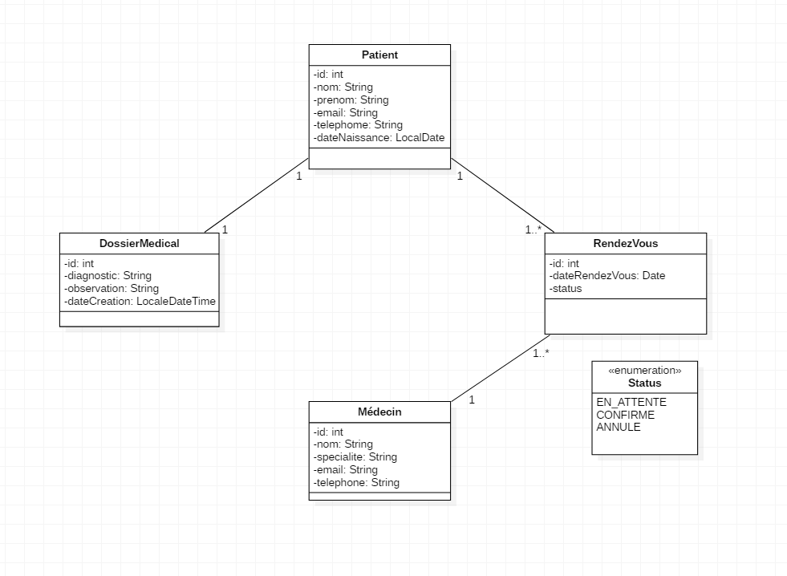
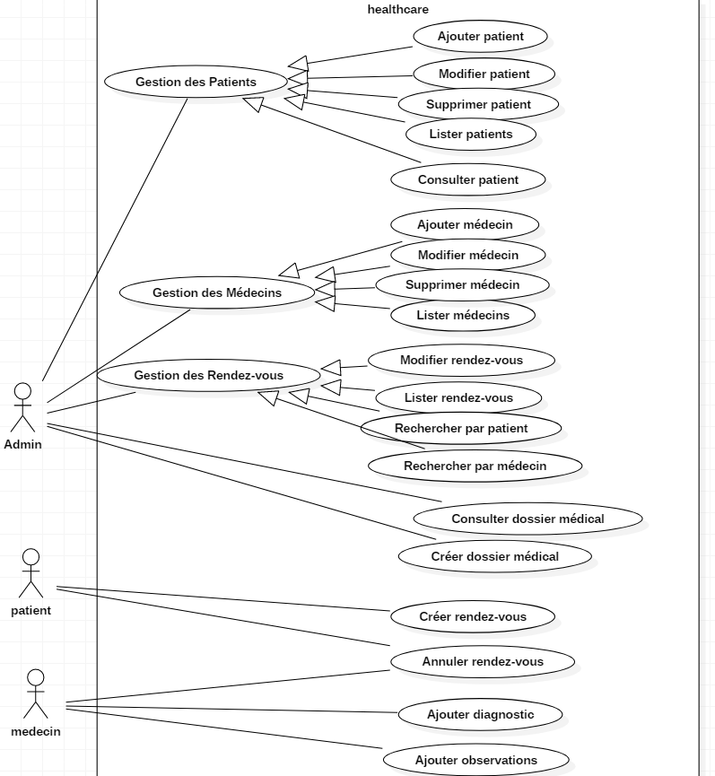
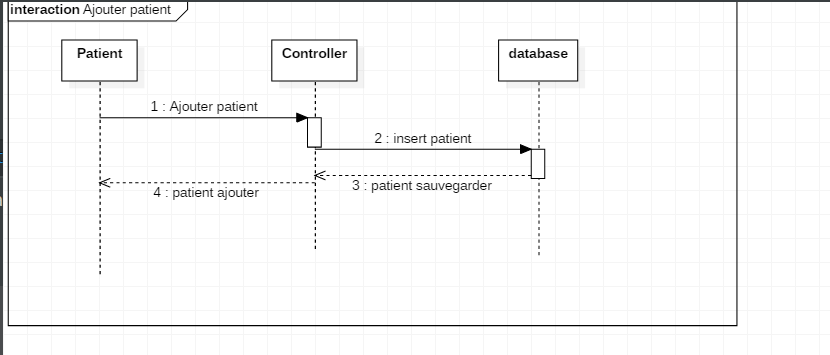

# HealthCare API

## Description

API REST développée avec Spring Boot pour la gestion d’un système médical permettant de gérer les patients,
les médecins, les rendez-vous et les dossiers médicaux.

## Technologies utilisées

* Java 17 / 21
* Spring Boot
* Spring Data JPA / Hibernate
* Maven
* MySQL
* MapStruct
* Swagger
* JUnit
* Docker

---

## Fonctionnalités

### Patient

* Ajouter patient
* Modifier patient
* Supprimer patient
* Lister patients
* Consulter patient

### Médecin

* Ajouter médecin
* Modifier médecin
* Supprimer médecin
* Lister médecins

### Rendez-vous

* Créer rendez-vous
* Modifier rendez-vous
* Annuler rendez-vous
* Lister rendez-vous
* Rechercher par patient
* Rechercher par médecin

### Dossier Médical

* Créer dossier médical
* Ajouter diagnostic
* Ajouter observation
* Consulter dossier médical

---

##  Architecture

Architecture MVC :

* Controller
* Service
* Repository
* Entity
* DTO

---

##  Documentation API

Swagger disponible sur :
http://localhost:8080/swagger-ui.html

##  Code source

Le repository contient tous les fichiers nécessaires à l’exécution de l’application (code source, configuration, dépendances, tests, Dockerfile).

## Diagrammes UML

* Diagramme de classes

* Diagramme de cas d’utilisation
* 
* Diagramme de séquence

---

## Auteur

* Ton Nom
